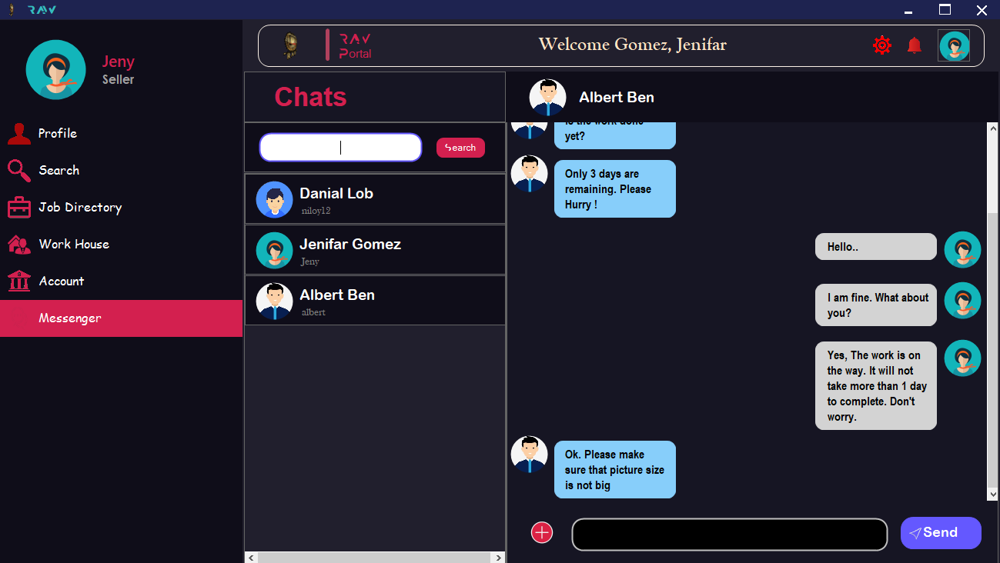

# Remotely Assistant Workers (RAW)

| WELCOME TO RAW(REMOTELY ASSISTANT WORKERS) |

 ---------------
| Introduction |
 ---------------

Remotely Assistant Workers or "RAW" was built with a view to reducing the unemployment problem and increasing the platform for remotely working. It is built with complete C#. The project is completed with the required features of RAW users. Buyer can easily find any type of job and Seller can post jobs to get the work done. This system is designed in the best way for both Users.

Thank you everyone.

>> YouTube video link:

-------------------
| Required System |
-------------------

 >> Any version of windows operating system which is compatible to run Microsoft Visual Studio.
 >> Microsoft Visual Studio 2019
 >> Microsoft SQL Server Management Studio

--------------------------
| Minimum Specifications |
--------------------------

    1. Operating System : Windows® 7/8/10/11
    2. Processor	: Intel® Core™ i3
    3. Memory		: 2 GB RAM
    4. Graphics		: Not Required
    5. Network		: Broadband Internet Connection
    6. Storage		: 500 MB

---------------------------
| How to run [Using .sln] |
---------------------------

 >> Open SQL Server Management Studio and click on "New Query" option.
 >> Paste the statement "CREATE DATABASE RAW
                         CREATE DATABASE RAW_MESSENGER" and click on "Execute" option.
 >> Connect to server and copy the server name.
 >> Open "RAW.sln" in Microsoft Visual Studio.
 >> Go to "View" and click on "Server Explorer" option or only press "Ctrl+Alt+S".
 >> Click right button of "Data Connections" and select "Add Connection".
 >> Paste the server name in the Server Name Box, select database "RAW" from option and press OK. Do the same process for database "RAW_MESSENGER".
 >> Click right button of the data connection of "RAW" and go to properties or press "Alt+Enter". Copy the connection string.
 >> Go to "View" and click on "Solution Explorer" option or only press "Ctrl+Alt+L".
 >> Open "App.config" file and paste the connection string instead of default string of connectionString of "RAW". Do the same process for "RAW_MESSENGER".
 >> Finally, RAW is ready to Run. Click the run button to get access of "RAW".

--------------------
| How to use "RAW" |
--------------------

 >> First, make sure your screen size is '100%'.
 >> If you are new to RAW, then at first you have to sign up with proper information.
 >> If you are looking for people to get work done, make sure you have signed up as a "Buyer".
 >> You can get various categories of work by signing up as a "Seller".
 >> For entering email, a valid email is required.
 >> To verify yourself you must enter the OTP after confirming the password.
 >> For mobile number, you have to give a valid mobile number. 
 >> You must fill all the required field.
 >> The generated account no of your account must be noted for further purposes.
 >> After sign up, you have to login first by providing Username and Password, used while signing up.
 >> There are 2 different users: Seller & Buyer.

   Seller :

           1. Profile                      - An equipped profile page is given here. You can edit profile and search other users.
	   2. Search                       - Apply for any job based on the searched job.	
           3. Job Directory                - Applied for jobs that are pending action will be displayed here.	              
           6. Recent Job                   - Recent works in progress will be shown here.
           7. Submitted Job                - Already submitted and pending actions will be displayed here.
           8. Previous Job                 - Already submitted and payment cleared jobs will be categorized here.
           9. Cancel Job                   - You may cancel any job that is running.
          10. Account                      - You can deposit or withdraw money. Sellers' payment is given from the Account section.
          11. Messenger                    - Search for any users and messaging with them is also possible through RAW.  
	   

   Buyer :

           1. Profile                      - An equipped profile page is given here. You can edit profile and search other users.
	   2. Search                       - Search for any type of job.
           3. Job Post                     - You can post a job by giving required informations.	              
           4. ManageJob                    - You may update the job details, accept/reject Seller responses.
           5. View Applicant               - View which sellers are interested to do the job.
           6. Recent Job                   - Recent works in progress will be shown here.
           7. Submitted Job                - Already submitted and pending actions will be displayed here.
           8. Previous Job                 - Already submitted and payment cleared jobs will be categorized here.
           9. Cancel Job                   - You may cancel any job that is running.
          10. Account                      - You can deposit or withdraw money. Sellers' payment is given from the Account section.
          11. Messenger                    - Search for any users and messaging with them is also possible through RAW. 
         
 >> There are some other options for RAW Users.

   User Options:

           1. About                        - This will give a small view of RAW and a short description of the developers.
           2. Contact                      - User can contact to admin for any issue.
           3. Feedback                     - Feedback will help to improve the system and serve the user better.
           4. Report                       - If user faces any problem using the system, reporting will help.

---------------------------
| Background Informations |
---------------------------

At present time unemployment problem is a big problem. The recent world is very digitalized 
and commercial. In that commercial world to find a better rhythm between the carrier and life 
goals most of the people want to be a freelancer. To make some 
extra income, freelancing is a good choice.

Freelancing is basically a platform where a user can find remote work from other users. They can 
communicate with each other for a better understanding of the work. Users can do any task from 
anywhere, anytime. Basically, it is a great source for earning money for those who know what to 
do and how to do it. 
 
From this point onward, the system is going to be introduced here is "Remotely Assistant Workers" or "RAW" in short. Through this system evaluation of remote work is much more easier and effective.

----------------------------
| Developer's Informations |
----------------------------

	 1. Niloy Kanti Paul
	    Email	: niloykantipaul@gmail.com
	    LinkedIn	: https://www.linkedin.com/in/niloy-kanti-paul-5543181ab/
	    Github	: https://github.com/DEV-NKP

	 2. Kaushik Biswas
	    Email	: biswaskaushik.2020@gmail.com
	    LinkedIn	: https://www.linkedin.com/in/kaushik-biswas-2b6554243/
	    Github	: https://github.com/Kaushik-Biswas

	 3. Dipanwita Saha
            Email	: dipanwitasaha7009@gmail.com
	    LinkedIn	: https://www.linkedin.com/in/dipanwita-saha-a772aa215/
	    Github	: https://github.com/Dipanwita-Saha

----------------------
| Project Highlights |
----------------------

>> Raw's landing page has an attractive and well-structured design and basic options are given here in a simple way.

>> RAW has a organized log in page for both different Users.

>> The User profile is designed with the necessary information that gives brief details of the User.

>> Other Users' profiles can be searched from the Profile section.

>> Jobs must be posted with the required information. To identify different jobs, a unique job id is generated.

>> After posting a job, the Buyer can modify the job details and view the applicants that applied.

>> All types of jobs can be found in Search section. It also shows the number of available jobs. 

>> A RAW account is created for both Users to do the payment criteria. Users can withdraw or deposit money with a single click. 

>> All the requested jobs that are pending can be canceled from the Seller's Job Directory.

>> The remaining time of a job is shown in an easy way. The countdown will remind the User of the pending job.

>> Both Users can cancel job after accepting the job offer.

>> The work is submitted by a link that ensures security of the task.

>> Both Users can rate each other to maintain the profile quality.

>> RAW provides the facility to exchange messages with Users in the system.

>> Skills are given with commas so that the system of RAW easily can identify skills. 

>> To report User there are problem types given to make easy to identify issue. 

>> There are three options to report User so that the user can give more detail about the report's reason.

>> RAW has a unique and designed logo.

********************************************ⒸAll Rights Reserved By "TEAM_RAW"********************************************

